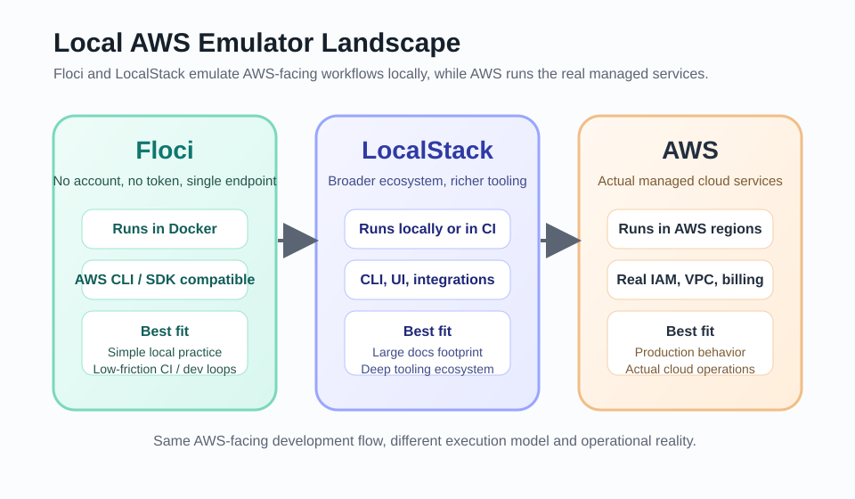
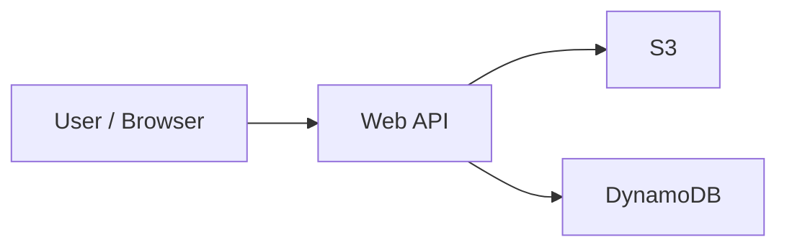
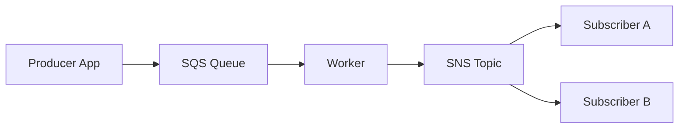
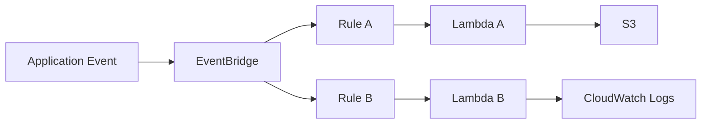
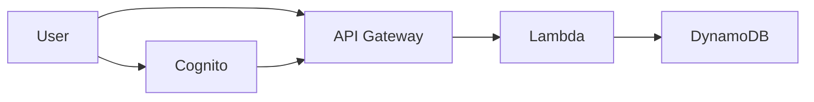

# floci로 AWS를 로컬에서 시뮬레이션해 애플리케이션 올리기

`floci`는 로컬 개발과 CI 환경에서 AWS 서비스를 가볍게 에뮬레이션할 수 있도록 만든 오픈소스 로컬 AWS 서비스 에뮬레이터입니다. AWS 계정이 없거나, 실습 비용이 부담되거나, 빠르게 로컬에서 인프라 시나리오를 검증하고 싶은 개발자에게 특히 유용합니다.

이 문서는 다음 독자를 대상으로 합니다.

- AWS 비용이 부담되는 초보 개발자
- 인프라 실습을 빠르게 반복하고 싶은 엔지니어
- AWS 서비스를 로컬에서 먼저 체험해 보고 싶은 학습자

이번 README의 범위는 `floci`의 개요, 지원 서비스, 요구사항, 설치/실행 방법, 예시 명령어, AWS 대비 제한사항, 그리고 실행 가능한 핸즈온과 향후 확장 방향까지입니다.

## 한눈에 보기

| floci | LocalStack | AWS |
|---|---|---|
|  |  |  |
| 계정 없이 빠르게 시작하는 로컬 AWS 에뮬레이터 | 널리 알려진 대표 로컬 AWS 에뮬레이터 | 실제 관리형 클라우드 환경 |

## 왜 floci를 쓰는가

공식 문서 기준으로 `floci`는 다음 가치를 강조합니다.

- 빠르고 무료이며 오픈소스다.
- 실제 AWS wire protocol을 사용해 기존 AWS CLI와 SDK 패턴을 그대로 활용할 수 있다.
- 로컬 개발과 CI에서 비용, 계정 준비, 벤더 락인 부담을 줄일 수 있다.
- 기본 엔드포인트 하나(`http://localhost:4566`)로 여러 서비스를 함께 띄울 수 있다.

즉, AWS를 완전히 대체하는 것이 목적이라기보다, 개발과 테스트 단계에서 AWS와 유사한 사용 흐름을 빠르게 검증하는 데 초점을 둔 도구라고 보는 편이 정확합니다.

## 지금 바로 실행 가능한 핸즈온

현재 이 저장소에는 아래 10개의 runnable hands-on이 있습니다.

- [이미지 업로드 갤러리](./apps/image-gallery/README.md)
- [주문 접수와 비동기 처리](./apps/order-processing/README.md)
- [회원가입/로그인 포털](./apps/auth-portal/README.md)
- [할 일 관리 API + 상태 로그](./apps/todo-logs/README.md)
- [알림 센터](./apps/alert-center/README.md)
- [파일 처리 파이프라인](./apps/file-pipeline/README.md)
- [비밀 보관함](./apps/secret-vault/README.md)
- [기능 플래그 대시보드](./apps/feature-flags/README.md)
- [스트림 인스펙터](./apps/stream-inspector/README.md)
- [CloudFormation Playground](./apps/cloudformation-playground/README.md)

핵심 공통 규칙:

- endpoint: `http://localhost:4566`
- profile: `floci`
- AWS 설정 파일: 저장소 내부 `.aws-local/`
- 환경: `macOS`, `WSL Ubuntu`

빠른 시작:

```bash
bash ops/bootstrap-floci.sh
npm run priority3:setup
```

전체 검증:

```bash
npm run priority3:smoke
```

핸즈온 요약 인덱스는 [apps/README.md](./apps/README.md)에서 볼 수 있습니다.

10개 전체를 한 번에 검증하려면:

```bash
npm run all10:smoke
```

## Known Limitations

현재 이 저장소는 `floci`가 실제로 잘 붙는 서비스 중심으로 hands-on을 구성했습니다. 아래는 아직 보류된 항목입니다.

- `RDS + ElastiCache`
  - 공식 문서상 지원 서비스이지만, 현재 환경에선 runtime/proxy 단계가 안정적으로 붙지 않았습니다.
- `EventBridge + Lambda`
  - 현재 환경에서 Lambda runtime 컨테이너 기동이 `Permission denied`로 막혔습니다.
- `auth-portal`
  - 현재는 `Cognito-first bootstrap`입니다.
  - `API Gateway v2 + Lambda`를 실제 리소스로 연결하는 예제는 후속 단계입니다.

즉, 이 저장소는 “문서상 지원 서비스 전체를 완벽히 재현”하기보다, “현재 환경에서 실제로 반복 학습 가능한 runnable hands-on”에 우선순위를 두고 있습니다.

## Release Notes

이번 버전에서 정리된 내용:

- runnable hands-on 10개 구성
- 공통 endpoint/profile 규칙 통일
- `.aws-local` 기반 격리된 AWS CLI 설정
- 초보자용 설치/요구사항 문서 추가
- 각 앱 README에
  - AWS 참고 링크
  - Mermaid 아키텍처
  - Excalidraw 워크플로
  - Trade-off 표
  - 단계별 hands-on 가이드
  - 중간 테스트와 최종 smoke 절차
- 전체 smoke 스크립트 기준 10개 예제 통과

## floci와 LocalStack을 어떻게 봐야 하나

AWS 로컬 에뮬레이터 비교 자료를 찾을 때는 보통 `LocalStack`이 먼저 나옵니다. 자료량, 인지도, 서비스 커버리지 관점에서 여전히 가장 널리 알려진 선택지 중 하나이기 때문입니다. 따라서 비교 기준 자체로는 `LocalStack`을 함께 보는 것이 자연스럽습니다.

다만 `floci`를 별도로 검토할 이유도 분명합니다.

- `floci` 공식 문서 기준으로 계정 생성이나 인증 토큰 없이 바로 Docker로 실행할 수 있다.
- 단일 엔드포인트와 단순한 실행 구조 덕분에 초보 학습자 입장에서 시작 장벽이 낮다.
- 로컬 개발과 CI에서 비용과 운영 복잡도를 줄이는 데 초점을 둔다.

반대로 `LocalStack`에 대해서는 2026년 3월 기준 다음 변화가 공식 발표되었습니다.

- `2026-03-23`부터 최신 `LocalStack for AWS` 릴리스는 단일 이미지로 제공된다.
- 같은 날짜부터 최신 버전을 사용하려면 `LocalStack` 계정과 `auth token`이 필요하다.
- 기존 `Community edition`은 같은 시점부터 더 이상 정기 업데이트 대상으로 유지되지 않는다.
- 다만 무료 플랜 자체는 계속 제공되며, `LocalStack` 서비스가 종료되는 것은 아니다.

따라서 `floci`를 선택하는 이유를 "`LocalStack`이 끝난다"라고 적는 것은 부정확합니다. 더 정확한 표현은 아래와 같습니다.

- `LocalStack`은 계속 존재하지만, 2026년 3월 23일부터 최신 버전 접근 방식과 배포 모델이 바뀌었다.
- 계정 없이 바로 시작하는 단순한 로컬 AWS 에뮬레이터가 필요하다면 `floci`는 충분히 검토할 가치가 있다.

## floci vs LocalStack 간단 비교

이 비교는 두 제품의 전체 우열을 가리는 표가 아니라, 이 README의 맥락에서 왜 `floci`를 보는지 설명하기 위한 간단한 관점 정리입니다.

| 항목 | floci | LocalStack |
|---|---|---|
| 시작 방식 | 공식 문서 기준 Docker로 바로 실행 | 2026-03-23 이후 최신 버전 사용 시 계정 + auth token 필요 |
| 학습 진입 장벽 | 비교적 낮음 | 상대적으로 더 많은 생태계/설정 이해 필요 |
| 문서/인지도 | 상대적으로 작음 | 매우 큼 |
| 이 README에서의 의미 | 가볍고 빠른 실습용 대안 | 비교 기준으로 가장 먼저 검토할 대표 대안 |
| 주의할 점 | 공식 문서 기준 지원 범위를 넘겨 추정하면 안 됨 | “종료”가 아니라 “배포/인증 모델 변화”로 이해해야 함 |

## 실제 AWS와의 구동 원리 차이

`floci`와 `LocalStack`은 둘 다 로컬 AWS 에뮬레이터이고, 실제 AWS는 관리형 클라우드 서비스입니다. 따라서 “무엇이 더 낫다”의 비교보다는, “어떻게 다르게 동작하는가”를 이해하는 것이 중요합니다.



| 항목 | floci / LocalStack 같은 로컬 에뮬레이터 | 실제 AWS |
|---|---|---|
| 실행 위치 | 개발자 로컬 머신 또는 CI 컨테이너 안에서 실행 | AWS 리전 내 관리형 인프라에서 실행 |
| 서비스 제공 방식 | 단일 프로세스 또는 컨테이너가 여러 AWS API를 흉내 냄 | 서비스별로 분리된 실제 관리형 시스템이 동작 |
| 엔드포인트 구조 | 보통 단일 로컬 엔드포인트 중심 | 서비스별, 리전별, 계정 맥락별 엔드포인트 사용 |
| 인증/권한 | 더미 자격증명 또는 단순화된 인증 흐름으로 시작 가능 | 실제 IAM, 계정, 역할, 정책, 조직 구조가 개입 |
| 데이터 저장 | 메모리 또는 로컬 볼륨에 저장 | AWS의 관리형 스토리지 계층에 영속적으로 저장 |
| 네트워크 모델 | 로컬 Docker 네트워크 또는 단일 머신 중심 | VPC, 서브넷, 라우팅, 보안 그룹, 퍼블릭/프라이빗 구성이 포함 |
| 운영 책임 | 사용자가 컨테이너, 볼륨, 포트, 리소스를 직접 관리 | AWS가 서비스 운영 상당 부분을 관리 |
| 목표 | 개발, 테스트, 학습, CI 검증 | 실제 운영, 확장성, 보안, 가용성 보장 |

즉, 로컬 에뮬레이터는 “AWS를 로컬에서 완전히 재현”한다기보다, “AWS API와 사용 흐름의 일부를 로컬에서 빠르게 검증”하는 데 가깝습니다.

학습 관점에서는 다음처럼 이해하면 됩니다.

- `floci`와 `LocalStack`은 AWS SDK, AWS CLI, 인프라 흐름을 익히는 출발점이다.
- 실제 운영 단계에서는 IAM, 네트워크, 계정 구조, 영속성, 보안 정책 같은 AWS 고유 요소를 별도로 검증해야 한다.
- 따라서 로컬 에뮬레이터에서 잘 동작했다는 사실만으로 실제 AWS 운영 적합성까지 보장되지는 않는다.

## 지원 서비스 목록

공식 서비스 개요 기준으로 `floci`는 `19+`개 AWS 서비스를 지원합니다.

| 서비스 | 프로토콜 | 공식 문서상 지원 작업 수 |
|---|---|---:|
| SSM Parameter Store | JSON 1.1 | 12 |
| SQS | Query / JSON | 20 |
| SNS | Query / JSON | 17 |
| S3 | REST XML | 50+ |
| DynamoDB | JSON 1.1 | 19 |
| DynamoDB Streams | JSON 1.1 | 4 |
| Lambda | REST JSON | 18 |
| API Gateway v1 | REST JSON | 40+ |
| API Gateway v2 | REST JSON | 20 |
| Cognito | JSON 1.1 | 24 |
| KMS | JSON 1.1 | 18 |
| Kinesis | JSON 1.1 | 21 |
| Secrets Manager | JSON 1.1 | 14 |
| CloudFormation | Query | 20 |
| Step Functions | JSON 1.1 | 12 |
| IAM | Query | 60+ |
| STS | Query | 7 |
| ElastiCache | Query + RESP proxy | 8 |
| RDS | Query + wire proxy | 13 |
| EventBridge | JSON 1.1 | 14 |
| CloudWatch Logs | JSON 1.1 | 14 |
| CloudWatch Metrics | Query / JSON | 8 |

참고:

- 공식 문서에는 `19+` 서비스라고 표기되지만, 서비스 매트릭스에는 `DynamoDB Streams`, `API Gateway v1/v2`, `CloudWatch Logs/Metrics`가 세분화되어 보입니다.
- 이 문서는 공식 문서에 적힌 범위만 정리하며, 문서에 명시되지 않은 미지원 기능은 추정하지 않습니다.

## 요구사항

### 기본 실행 요구사항

- `Docker 20.10+`
- `docker compose v2+`

### 소스에서 직접 빌드할 경우

- `Java 25+`
- `Maven 3.9+`
- 선택 사항: 네이티브 빌드를 위한 `GraalVM Mandrel`

### 서비스별 추가 요구사항

공식 Docker Compose 문서 기준으로 대부분의 서비스는 `4566` 포트 하나로 충분하지만, 아래 서비스는 추가 조건이 있습니다.

- `Lambda`, `ElastiCache`, `RDS`
  - `/var/run/docker.sock` 마운트 필요
  - 추가 포트 범위 오픈 필요
  - 같은 Docker 네트워크에 붙도록 설정 필요

## 설치 방법

가장 간단한 설치 방식은 Docker 이미지를 사용하는 것입니다.

```bash
docker pull hectorvent/floci:latest
```

공식 문서의 태그 의미는 다음과 같습니다.

- `latest`: 네이티브 이미지, 기본 권장값
- `latest-jvm`: JVM 이미지, 더 넓은 플랫폼 호환성 필요 시 사용

공식 문서의 대략적인 특성 비교:

| 이미지 | 시작 시간 | 유휴 메모리 |
|---|---:|---:|
| `latest` | `< 100 ms` | `~50 MB` |
| `latest-jvm` | `~2 s` | `~250 MB` |

## 빠른 시작

### 1. 최소 구성으로 실행

대부분의 서비스는 아래 Compose 예시로 시작할 수 있습니다.

```yaml
services:
  floci:
    image: hectorvent/floci:latest
    ports:
      - "4566:4566"
    volumes:
      - ./data:/app/data
```

```bash
docker compose up -d
```

실행 후에는 다음처럼 바로 AWS CLI를 사용할 수 있습니다.

```bash
aws --endpoint-url http://localhost:4566 s3 mb s3://my-bucket
```

### 2. Lambda, ElastiCache, RDS까지 포함하는 전체 구성

이 세 서비스는 공식 문서상 Docker socket과 추가 포트 노출이 필요합니다.

```yaml
services:
  floci:
    image: hectorvent/floci:latest
    ports:
      - "4566:4566"
      - "6379-6399:6379-6399"
      - "7001-7099:7001-7099"
    volumes:
      - /var/run/docker.sock:/var/run/docker.sock
      - ./data:/app/data
    environment:
      FLOCI_SERVICES_DOCKER_NETWORK: my-project_default
```

## AWS CLI 연결 방법

`floci`는 비어 있지 않은 아무 자격증명이나 받아들입니다. 실제 AWS 계정은 필요하지 않습니다.

중요:

- `floci`가 AWS CLI 자체를 대체하는 것은 아닙니다.
- 기존에 사용하던 `aws` 명령을 그대로 쓰되, 요청 대상을 `floci` 엔드포인트로 바꿔 보내는 방식입니다.
- 따라서 `--endpoint-url`이나 전용 프로필을 잘못 설정하면, 명령이 실제 AWS로 나갈 수도 있습니다.

### 기존 AWS CLI 사용자가 가장 안전하게 쓰는 방법

기존에 실제 AWS 계정과 프로필을 이미 쓰고 있다면, 기본 프로필을 바꾸지 말고 `floci` 전용 프로필을 따로 만드는 것이 가장 안전합니다.

권장 패턴:

- 실제 AWS용 `default` 또는 기존 프로필은 그대로 유지
- `floci` 전용 프로필을 별도로 생성
- `floci`를 사용할 때만 `--profile floci --endpoint-url http://localhost:4566`를 명시

가장 안전한 예시:

```bash
aws s3 ls --profile floci --endpoint-url http://localhost:4566
aws dynamodb list-tables --profile floci --endpoint-url http://localhost:4566
aws sqs create-queue --profile floci --endpoint-url http://localhost:4566 --queue-name demo-queue
```

이 방식의 장점:

- 실수로 실제 AWS `default` 프로필을 덮어쓰지 않는다.
- 어떤 명령이 `floci`로 가는지 한눈에 보인다.
- 팀 문서나 스크립트에 넣었을 때도 의도가 명확하다.

### 환경 변수 방식

```bash
export AWS_ENDPOINT=http://localhost:4566
export AWS_DEFAULT_REGION=us-east-1
export AWS_ACCESS_KEY_ID=test
export AWS_SECRET_ACCESS_KEY=test
```

### CLI 프로필 방식

`~/.aws/config`

```ini
[profile floci]
region = us-east-1
output = json
```

`~/.aws/credentials`

```ini
[floci]
aws_access_key_id = test
aws_secret_access_key = test
```

사용 예시:

```bash
aws s3 ls --profile floci --endpoint-url http://localhost:4566
aws sqs create-queue --profile floci --endpoint-url http://localhost:4566 --queue-name demo-queue
```

또는 셸 세션에서 기본값으로 둘 수 있습니다.

```bash
export AWS_PROFILE=floci
export AWS_ENDPOINT=http://localhost:4566
```

주의:

- 이 방식은 현재 셸 세션 전체에 영향을 줍니다.
- 기존에 여러 AWS 계정/프로필을 오가며 작업하는 사용자라면, 세션 전역 변수 방식보다 명령마다 `--profile`과 `--endpoint-url`을 붙이는 방식이 더 안전합니다.
- `AWS_PROFILE`이나 엔드포인트 관련 환경 변수를 해제하지 않은 채 다른 작업을 하면, 의도와 다른 대상으로 명령을 보낼 수 있습니다.

예를 들어 작업이 끝난 뒤에는 다음처럼 원복할 수 있습니다.

```bash
unset AWS_PROFILE
unset AWS_ENDPOINT
unset AWS_ACCESS_KEY_ID
unset AWS_SECRET_ACCESS_KEY
unset AWS_DEFAULT_REGION
```

## SDK 연결 예시

### Python (boto3)

```python
import boto3

def floci_client(service_name: str):
    return boto3.client(
        service_name,
        endpoint_url="http://localhost:4566",
        region_name="us-east-1",
        aws_access_key_id="test",
        aws_secret_access_key="test",
    )

s3 = floci_client("s3")
sqs = floci_client("sqs")
dynamodb = floci_client("dynamodb")
```

### Node.js / TypeScript

```ts
import { DynamoDBClient } from "@aws-sdk/client-dynamodb";
import { SQSClient } from "@aws-sdk/client-sqs";

const config = {
  endpoint: "http://localhost:4566",
  region: "us-east-1",
  credentials: {
    accessKeyId: "test",
    secretAccessKey: "test",
  },
};

const dynamo = new DynamoDBClient(config);
const sqs = new SQSClient(config);
```

S3를 AWS SDK for JavaScript v3로 사용할 때는 공식 문서상 `forcePathStyle: true` 설정이 필요합니다. `floci`의 S3는 path-style URL(`http://localhost:4566/bucket-name`)을 사용합니다.

## 알아두면 좋은 설정

공식 문서 기준 기본값은 다음과 같습니다.

- 기본 Region: `us-east-1`
- 기본 Account ID: `000000000000`
- 기본 스토리지 모드: `memory`

예를 들어 SQS Queue URL과 ARN은 다음 형태를 가집니다.

```text
arn:aws:sqs:us-east-1:000000000000:my-queue
http://localhost:4566/000000000000/my-queue
```

기본 스토리지는 메모리이므로, 재시작 시 데이터가 사라집니다. 데이터를 유지하려면 공식 문서의 `persistent` 스토리지 모드를 사용해야 합니다.

예시:

```yaml
services:
  floci:
    image: hectorvent/floci:latest
    ports:
      - "4566:4566"
    volumes:
      - ./data:/app/data
    environment:
      FLOCI_STORAGE_MODE: persistent
      FLOCI_STORAGE_PERSISTENT_PATH: /app/data
```

## AWS 대비 제한사항 / 주의사항

아래 내용은 공식 문서에 직접 드러난 범위만 정리한 것입니다.

1. `floci`는 AWS 전체를 완전히 대체하지 않습니다.
공식 문서도 서비스별 지원 작업 수를 따로 공개하고 있으므로, 각 서비스는 AWS 전체 기능 중 일부 범위를 구현한 것으로 이해하는 편이 안전합니다.

2. 기본 구조가 단일 로컬 엔드포인트 중심입니다.
대부분의 호출은 `http://localhost:4566` 하나로 들어갑니다. 실제 AWS처럼 서비스별 퍼블릭 엔드포인트 구조와 동일한 운영 환경은 아닙니다.

3. 실제 AWS 계정과 인증 흐름이 필요하지 않습니다.
로컬 개발에는 장점이지만, IAM 정책, 실제 계정 경계, 조직/멀티계정 운영 같은 AWS 운영 현실을 그대로 재현하는 것은 아닙니다.

4. 일부 서비스는 Docker 의존성이 더 큽니다.
`Lambda`, `ElastiCache`, `RDS`는 Docker socket과 추가 포트 범위가 필요하므로, 단순 API 에뮬레이션보다 실행 환경 제약이 있습니다.

5. 기본 저장 방식은 메모리입니다.
설정을 바꾸지 않으면 재시작 시 상태가 사라집니다. 실제 AWS의 관리형 영속 환경과는 사용 감각이 다릅니다.

6. 문서에 없는 미지원 항목은 이 README에서 추정하지 않습니다.
공식 문서에 없는 차이나 제약은 여기서 단정하지 않았습니다. 서비스별 상세 호환 범위는 공식 서비스 문서를 함께 확인하는 것이 좋습니다.

## 비용 메모

로컬 머신에서 `floci`를 실행하는 동안 직접적인 AWS 서비스 과금은 발생하지 않습니다. 다만 아래는 별도로 생각해야 합니다.

- 로컬 장비의 CPU, 메모리, 디스크 사용량
- Docker 실행 비용
- 만약 `floci`를 EC2 같은 클라우드 VM 위에 올린다면, 그 VM 비용은 별도로 발생

즉, “AWS API를 직접 때리면서 과금되는 비용”은 줄일 수 있지만, “실행 환경 자체의 비용”까지 항상 `0`이라고 단정할 수는 없습니다.

## 샘플 아키텍처 미리보기

향후 핸즈온 문서를 만들 때는 `mermaid` 다이어그램을 함께 두면 서비스 관계를 빠르게 이해시키는 데 도움이 됩니다. 아래 예시는 실제 구현 문서가 아니라, 이후 확장할 아키텍처 방향을 보여주기 위한 미리보기입니다.

### 1. 단일 Web API + S3 + DynamoDB



적합한 용도:

- 파일 업로드 + 메타데이터 저장
- 간단한 CRUD 백엔드
- 초보 학습자의 첫 AWS 실습

### 2. 비동기 Worker + SQS + SNS



적합한 용도:

- 주문 처리, 알림 발송, 배치 분리
- 동기 API와 비동기 처리 흐름 분리
- 큐/토픽 기반 메시징 학습

### 3. 이벤트 기반 파이프라인 + EventBridge + Lambda



적합한 용도:

- 이벤트 기반 느슨한 결합 아키텍처
- 서버리스 처리 흐름 학습
- 규칙 기반 이벤트 라우팅 검증

### 4. 인증 포함 Web 서비스 + Cognito + API Gateway



적합한 용도:

- 로그인/인증이 필요한 API 서비스
- 토큰 기반 호출 흐름 학습
- API Gateway + Lambda 조합 검증

## 향후 제공할 핸즈온 아키텍처 방향

이미 1차 우선순위 3개는 실행 가능한 상태로 만들었고, 아래 목록은 그 다음에 확장할 후보들입니다.

### 1차 구현 예정

- [이미지 업로드 갤러리](./apps/image-gallery/README.md)
- [주문 접수와 비동기 처리](./apps/order-processing/README.md)
- [회원가입/로그인 포털](./apps/auth-portal/README.md)
- [할 일 관리 API + 상태 로그](./apps/todo-logs/README.md)
- [알림 센터](./apps/alert-center/README.md)
- [파일 처리 파이프라인](./apps/file-pipeline/README.md)
- [비밀 보관함](./apps/secret-vault/README.md)
- [기능 플래그 대시보드](./apps/feature-flags/README.md)
- [스트림 인스펙터](./apps/stream-inspector/README.md)
- [CloudFormation Playground](./apps/cloudformation-playground/README.md)

### 이후 확장 후보

- 단일 Web API + S3 + DynamoDB
- 비동기 Worker + SQS + SNS
- 이벤트 기반 파이프라인 + EventBridge + Lambda
- 인증 포함 Web 서비스 + Cognito + API Gateway
- MSA 기초 구성 + API Gateway + SQS + DynamoDB
- 배치 처리 구성 + Step Functions + Lambda + S3
- 로그/메트릭 실험 환경 + CloudWatch Logs/Metrics
- ML 추론 보조 파이프라인 + S3 + Lambda + EventBridge
- 데이터 적재/조회 흐름 + S3 + RDS
- 비밀 관리 포함 서비스 구성 + Secrets Manager + KMS

## 공식 문서

- 홈: https://hectorvent.dev/floci/
- 서비스 개요: https://hectorvent.dev/floci/services/
- 설치: https://hectorvent.dev/floci/getting-started/installation/
- AWS CLI / SDK 설정: https://hectorvent.dev/floci/getting-started/aws-setup/
- Docker Compose 설정: https://hectorvent.dev/floci/configuration/docker-compose/

## 비교 참고 자료

- LocalStack 변경 안내: https://blog.localstack.cloud/localstack-single-image-next-steps/
- LocalStack 가격/패키징 업데이트: https://blog.localstack.cloud/2026-upcoming-pricing-changes/
- LocalStack 장기 방향 안내: https://blog.localstack.cloud/the-road-ahead-for-localstack/

## 마무리

`floci`는 “AWS를 완벽히 복제하는 플랫폼”보다는, “로컬에서 AWS 사용 흐름을 빠르게 흉내 내며 개발과 테스트를 반복하게 해주는 도구”로 이해하면 가장 정확합니다. 비용에 민감한 학습자나 초기 개발 단계에서 특히 유용하며, 실제 운영 아키텍처로 넘어가기 전의 검증용 기반으로 활용하기 좋습니다.
