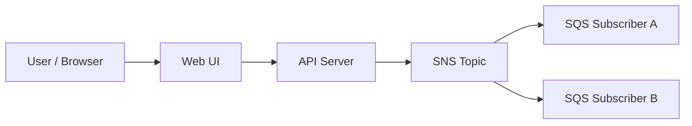
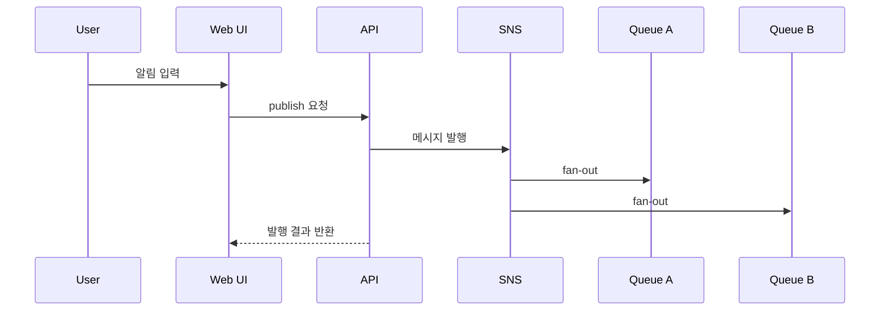

# 알림 센터

상태: `runnable bootstrap`

## 이 아키텍처를 AWS에서 왜 많이 쓰나

한 번 발행한 메시지를 여러 소비자에게 동시에 보내는 `SNS fan-out + SQS subscriber` 구조는 AWS 메시징의 핵심 패턴입니다.

AWS 참고 링크:
- SNS: https://docs.aws.amazon.com/sns/latest/dg/welcome.html
- SQS: https://docs.aws.amazon.com/AWSSimpleQueueService/latest/SQSDeveloperGuide/welcome.html

## Mermaid 아키텍처



## Mermaid 시퀀스



## Workflow (Excalidraw)

- [workflow.excalidraw](./workflow.excalidraw)

## Trade-off

| 좋아지는 점 | 나빠지는 점 | 언제 적합한가 |
|---|---|---|
| 같은 메시지를 여러 소비자에게 보낼 수 있음 | 메시지 흐름이 눈에 안 보이면 이해가 어려움 | 알림, fan-out 구조 |
| 발행자와 소비자를 느슨하게 분리 | 중복 소비와 관측이 필요 | 비동기 알림 |
| 새 소비자를 붙이기 쉬움 | 큐/토픽 개념을 둘 다 이해해야 함 | 이벤트 중심 설계 |

## 핸즈온 가이드

공통 준비는 [apps/README.md](../README.md)를 먼저 읽습니다.

### 1. 리소스 준비

```bash
bash ops/bootstrap-floci.sh
bash apps/alert-center/scripts/setup.sh
```

### 2. 서버 실행

```bash
node apps/alert-center/api/server.mjs
```

기본 주소: `http://127.0.0.1:3005`

### 3. 중간 확인

CLI:

```bash
aws --profile floci --endpoint-url http://localhost:4566 sns list-topics
aws --profile floci --endpoint-url http://localhost:4566 sqs list-queues
```

Web UI:

- 제목과 본문을 입력해 발행한다
- Subscriber A/B 양쪽 패널에 메시지가 모두 들어오는지 본다

## 리소스 상태 확인 (CLI)

### SNS topic 확인

```bash
bash ops/aws-local.sh sns list-topics
```

예시 출력:

```json
{
  "Topics": [
    {
      "TopicArn": "arn:aws:sns:us-east-1:000000000000:alert-center-topic"
    }
  ]
}
```

### SQS subscriber 큐 확인

```bash
bash ops/aws-local.sh sqs list-queues
```

예시 출력:

```json
{
  "QueueUrls": [
    "http://localhost:4566/000000000000/alert-center-subscriber-a",
    "http://localhost:4566/000000000000/alert-center-subscriber-b"
  ]
}
```

이렇게 해석합니다:

- topic 1개, subscriber queue 2개가 보여야 정상입니다.
- publish 후 두 큐에 모두 메시지가 들어가면 fan-out이 정상입니다.

### 4. 최종 검증

```bash
bash apps/alert-center/checks/smoke.sh
```
