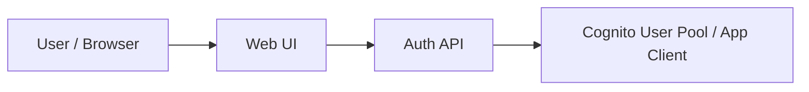
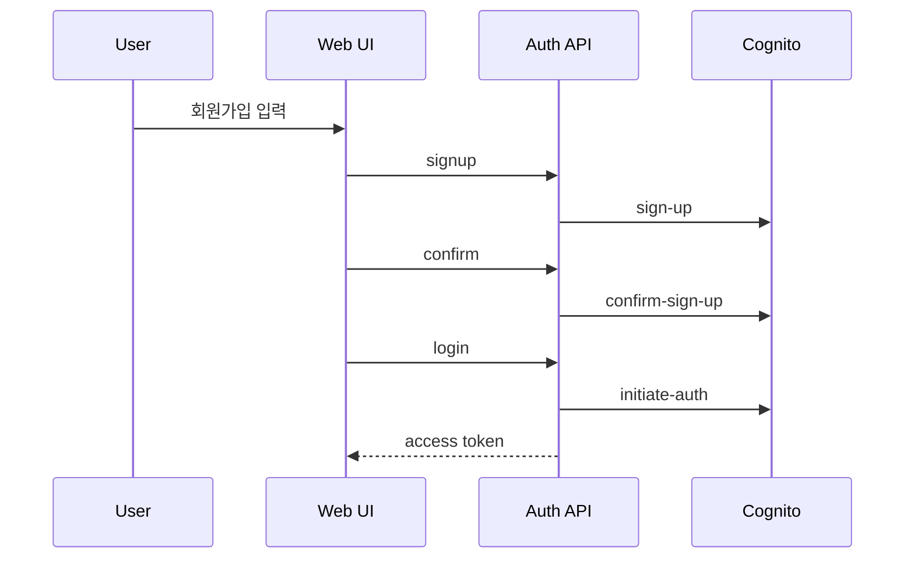
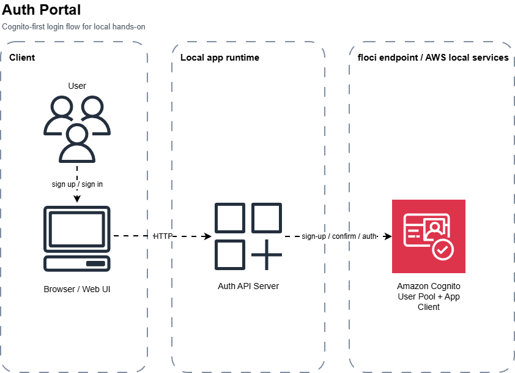

# 회원가입/로그인 포털

상태: `runnable bootstrap (Cognito-first)`

## 이 아키텍처를 AWS에서 왜 많이 쓰나

실제 AWS에서는 `Cognito User Pool`로 사용자 인증을 맡기고, 보호된 API는 `API Gateway` 또는 애플리케이션 서버에서 토큰을 검증하는 구조가 흔합니다.

AWS 참고 링크:
- Cognito User Pools: https://docs.aws.amazon.com/cognito/latest/developerguide/cognito-user-pools.html
- App Clients: https://docs.aws.amazon.com/cognito/latest/developerguide/user-pool-settings-client-apps.html

## Mermaid 아키텍처



## Mermaid 시퀀스



## Draw.io (AWS 공식 아이콘)

[draw.io source](./assets/auth-portal-architecture.drawio)



## Trade-off

| 좋아지는 점 | 나빠지는 점 | 언제 적합한가 |
|---|---|---|
| 인증 책임을 분리할 수 있음 | 개념이 많아 초보자에겐 어려울 수 있음 | 로그인/회원가입이 필요한 서비스 |
| 토큰 기반 보호 API를 쉽게 실험 가능 | 현재 hands-on은 Cognito-first라 API Gateway/Lambda는 후속 | 사용자 관리가 필요한 웹 서비스 |
| 실제 AWS 흐름과 유사한 감각을 줌 | confirmation/토큰 흐름 이해가 필요 | 인증이 핵심인 앱 |

## 핸즈온 가이드

공통 준비는 [apps/README.md](../README.md)를 먼저 읽습니다.

### 1. 리소스 준비

```bash
bash ops/bootstrap-floci.sh
bash apps/auth-portal/scripts/setup.sh
```

### 2. 서버 실행

```bash
node apps/auth-portal/api/server.mjs
```

기본 주소: `http://127.0.0.1:3003`

### 3. 중간 확인

CLI:

```bash
bash ops/aws-local.sh cognito-idp list-user-pools --max-results 10
```

Web UI:

- 회원가입
- 확인
- 로그인
- 프로필 조회

## 리소스 상태 확인 (CLI)

### User Pool 목록 확인

```bash
bash ops/aws-local.sh cognito-idp list-user-pools --max-results 10
```

예시 출력:

```json
{
  "UserPools": [
    {
      "Name": "auth-portal-users",
      "Id": "us-east-1_xxxxxxxx"
    }
  ]
}
```

이렇게 해석합니다:

- `auth-portal-users`가 보이면 user pool 생성은 정상입니다.

### App Client 확인

```bash
bash ops/aws-local.sh cognito-idp describe-user-pool-client --user-pool-id <USER_POOL_ID> --client-id <CLIENT_ID>
```

예시 출력:

```json
{
  "UserPoolClient": {
    "ClientId": "abcd1234",
    "ClientName": "auth-portal-web"
  }
}
```

이렇게 해석합니다:

- app client가 있어야 로그인과 토큰 발급이 가능합니다.

실제 `USER_POOL_ID`, `CLIENT_ID`는 아래 파일에서 확인할 수 있습니다.

```bash
cat apps/auth-portal/.runtime/cognito.json
```

### 4. 최종 검증

```bash
bash apps/auth-portal/checks/smoke.sh
```

주의:
- 현재 hands-on은 `confirm-sign-up(code=123456)` 경로를 사용합니다.
- `API Gateway v2 + Lambda` 연동은 후속 확장 단계입니다.
