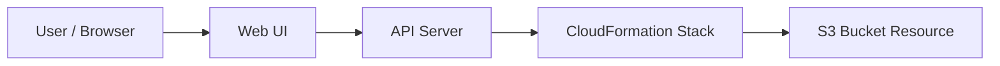
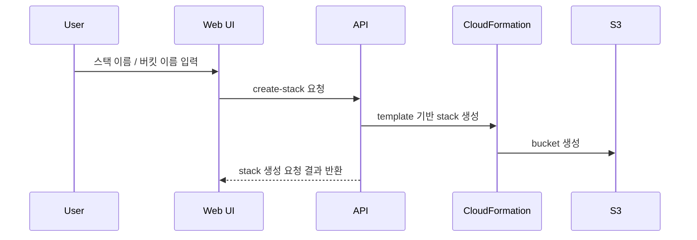

# CloudFormation Playground

상태: `runnable bootstrap`

## 이 아키텍처를 AWS에서 왜 많이 쓰나

CloudFormation은 템플릿으로 인프라를 선언하고, 반복 가능한 방식으로 리소스를 만들기 위한 AWS의 대표 IaC 도구입니다.

AWS 참고 링크:
- CloudFormation 시작하기: https://docs.aws.amazon.com/AWSCloudFormation/latest/UserGuide/GettingStarted.html
- S3 Bucket 리소스: https://docs.aws.amazon.com/AWSCloudFormation/latest/UserGuide/aws-resource-s3-bucket.html

## Mermaid 아키텍처



## Mermaid 시퀀스



## Workflow (Excalidraw)

- [workflow.excalidraw](./workflow.excalidraw)

## Trade-off

| 좋아지는 점 | 나빠지는 점 | 언제 적합한가 |
|---|---|---|
| 인프라를 템플릿으로 반복 생성 가능 | 처음엔 문법이 낯설다 | IaC 학습 |
| 생성 결과와 상태를 추적하기 쉬움 | 작은 변경에도 스택 개념을 이해해야 함 | 인프라 자동화 |
| 실전 AWS 감각을 주기 좋음 | 단일 CLI보다 설정량이 많음 | 리소스 관리 표준화 |

## 핸즈온 가이드

공통 준비는 [apps/README.md](../README.md)를 먼저 읽습니다.

### 1. 리소스 준비

```bash
bash ops/bootstrap-floci.sh
bash apps/cloudformation-playground/scripts/setup.sh
```

### 2. 서버 실행

```bash
node apps/cloudformation-playground/api/server.mjs
```

기본 주소: `http://127.0.0.1:3010`

### 3. 중간 확인

CLI:

```bash
aws --profile floci --endpoint-url http://localhost:4566 cloudformation list-stacks
```

Web UI:

- 스택 이름과 버킷 이름을 넣어 생성한다
- 스택 상태가 `CREATE_COMPLETE`로 가는지 본다

## 리소스 상태 확인 (CLI)

### 스택 목록 확인

```bash
bash ops/aws-local.sh cloudformation list-stacks
```

예시 출력:

```json
{
  "StackSummaries": [
    {
      "StackName": "smoke-cfn-123",
      "StackStatus": "CREATE_COMPLETE"
    }
  ]
}
```

### 생성 리소스 확인

```bash
bash ops/aws-local.sh s3 ls
```

이렇게 해석합니다:

- 스택이 `CREATE_COMPLETE`면 템플릿 적용은 성공입니다.
- 대응하는 bucket 이름이 S3 목록에 보이면 실제 리소스도 생성된 것입니다.

### 4. 최종 검증

```bash
bash apps/cloudformation-playground/checks/smoke.sh
```
