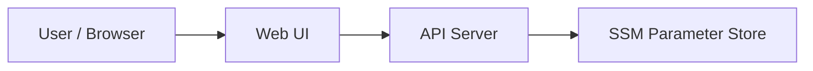
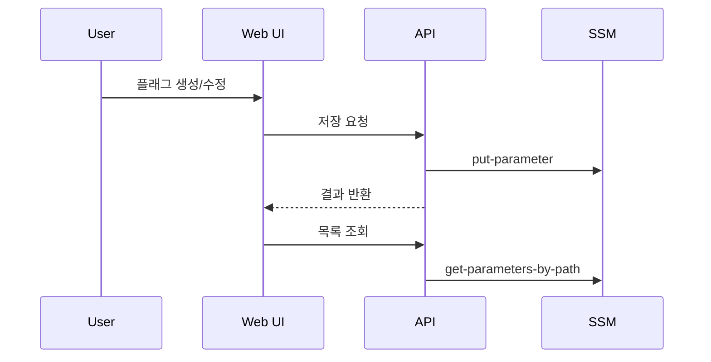

# 기능 플래그 대시보드

상태: `runnable bootstrap`

## 이 아키텍처를 AWS에서 왜 많이 쓰나

설정값과 feature flag를 코드에서 분리해 `SSM Parameter Store`에 두면, 환경별 설정과 실험 플래그를 더 안전하게 관리할 수 있습니다.

AWS 참고 링크:
- SSM Parameter Store: https://docs.aws.amazon.com/systems-manager/latest/userguide/systems-manager-parameter-store.html

## Mermaid 아키텍처



## Mermaid 시퀀스



## Workflow (Excalidraw)

- [workflow.excalidraw](./workflow.excalidraw)

## Trade-off

| 좋아지는 점 | 나빠지는 점 | 언제 적합한가 |
|---|---|---|
| 설정을 코드와 분리 가능 | 너무 많은 파라미터는 관리가 복잡 | 설정/feature flag 관리 |
| 계층형 경로로 구조화 가능 | 실시간 복잡한 rollout엔 부족할 수 있음 | 작은/중간 규모 앱 |
| 운영자가 값을 바꾸기 쉬움 | 값 타입 관리가 느슨할 수 있음 | 간단한 실험 플래그 |

## 핸즈온 가이드

공통 준비는 [apps/README.md](../README.md)를 먼저 읽습니다.

### 1. 리소스 준비

```bash
bash ops/bootstrap-floci.sh
bash apps/feature-flags/scripts/setup.sh
```

### 2. 서버 실행

```bash
node apps/feature-flags/api/server.mjs
```

기본 주소: `http://127.0.0.1:3008`

### 3. 중간 확인

CLI:

```bash
aws --profile floci --endpoint-url http://localhost:4566 ssm describe-parameters
```

Web UI:

- 플래그를 하나 만든다
- 값을 다시 수정한다
- 목록과 단건 조회가 일치하는지 확인한다

## 리소스 상태 확인 (CLI)

### 전체 파라미터 목록 확인

```bash
bash ops/aws-local.sh ssm get-parameters-by-path --path /app/flags --recursive
```

예시 출력:

```json
{
  "Parameters": [
    { "Name": "/app/flags/new-ui", "Value": "false" },
    { "Name": "/app/flags/checkout-v2", "Value": "true" }
  ]
}
```

이렇게 해석합니다:

- `/app/flags/` 아래 파라미터가 보이면 시드가 정상입니다.
- 새로 만든 플래그도 같은 경로 아래에 추가됩니다.

### 4. 최종 검증

```bash
bash apps/feature-flags/checks/smoke.sh
```
