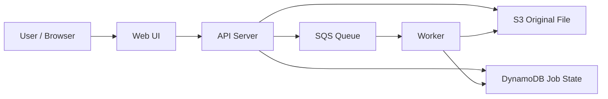
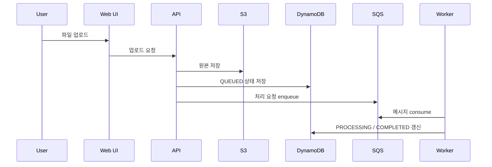
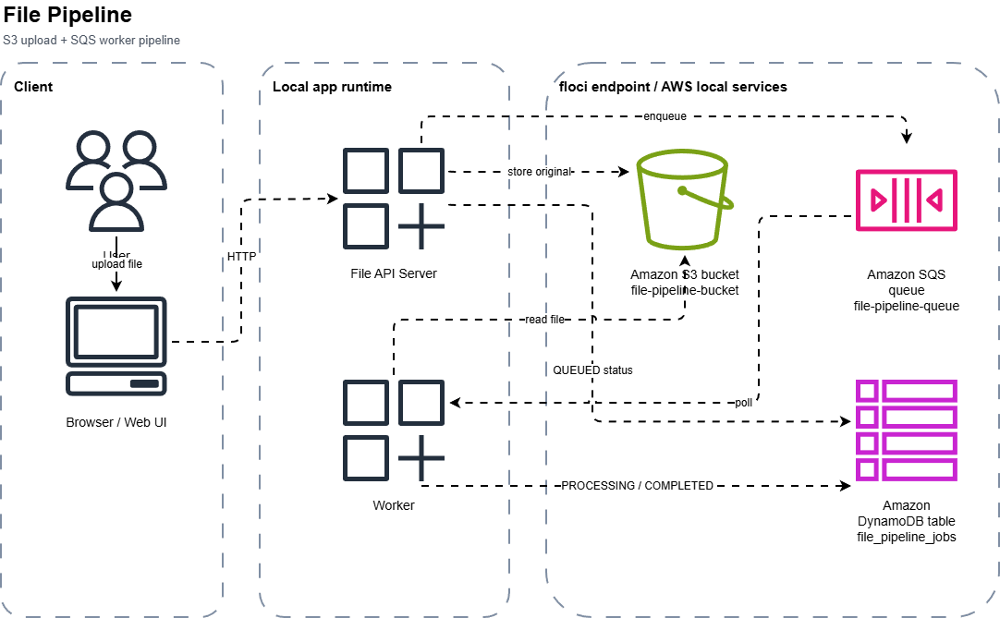

# 파일 처리 파이프라인

상태: `runnable bootstrap`

## 이 아키텍처를 AWS에서 왜 많이 쓰나

파일 업로드와 실제 처리를 분리하는 구조는 AWS에서 흔합니다.  
실전에서는 `S3 업로드 -> 큐 -> 워커/Lambda -> 상태 저장` 패턴으로 많이 갑니다.

AWS 참고 링크:
- S3: https://docs.aws.amazon.com/AmazonS3/latest/userguide/Welcome.html
- SQS: https://docs.aws.amazon.com/AWSSimpleQueueService/latest/SQSDeveloperGuide/welcome.html
- DynamoDB: https://docs.aws.amazon.com/amazondynamodb/latest/developerguide/Introduction.html

## Mermaid 아키텍처



## Mermaid 시퀀스



## Draw.io (AWS 공식 아이콘)

[draw.io source](./assets/file-pipeline-architecture.drawio)



## Trade-off

| 좋아지는 점 | 나빠지는 점 | 언제 적합한가 |
|---|---|---|
| 업로드와 처리 책임을 분리 | 흐름이 길어짐 | 대용량 파일 처리 |
| 상태 추적이 쉬움 | 리소스가 늘어남 | 비동기 파이프라인 |
| 재처리 구조를 만들기 좋음 | 즉시 완료가 어려움 | 후처리가 필요한 파일 서비스 |

## 핸즈온 가이드

공통 준비는 [apps/README.md](../README.md)를 먼저 읽습니다.

### 1. 리소스 준비

```bash
bash ops/bootstrap-floci.sh
bash apps/file-pipeline/scripts/setup.sh
```

### 2. 워커와 API 실행

```bash
node apps/file-pipeline/worker/worker.mjs
node apps/file-pipeline/api/server.mjs
```

기본 주소: `http://127.0.0.1:3006`

### 3. 중간 확인

CLI:

```bash
bash ops/aws-local.sh s3 ls
bash ops/aws-local.sh sqs list-queues
```

Web UI:

- 텍스트 파일을 업로드한다
- 상태가 `QUEUED -> PROCESSING -> COMPLETED`로 바뀌는지 본다
- 처리 바이트가 0보다 커졌는지 확인한다

## 리소스 상태 확인 (CLI)

### S3 bucket 확인

```bash
bash ops/aws-local.sh s3 ls
```

예시 출력:

```text
2026-03-24 14:03:33 file-pipeline-bucket
```

### 큐 확인

```bash
bash ops/aws-local.sh sqs list-queues
```

예시 출력:

```json
{
  "QueueUrls": [
    "http://localhost:4566/000000000000/file-pipeline-queue"
  ]
}
```

### 작업 상태 테이블 확인

```bash
bash ops/aws-local.sh dynamodb describe-table --table-name file_pipeline_jobs
```

이렇게 해석합니다:

- bucket은 원본 파일 저장소
- queue는 처리 요청 전달용
- table은 처리 상태 추적용입니다

### 4. 최종 검증

```bash
bash apps/file-pipeline/checks/smoke.sh
```
