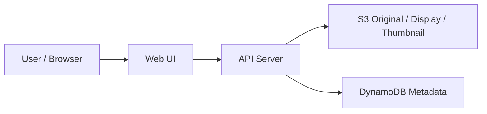

# 이미지 업로드 갤러리

상태: `runnable bootstrap`

## 이 아키텍처를 AWS에서 왜 많이 쓰나

이미지나 파일 원본은 `S3`, 검색과 목록용 메타데이터는 `DynamoDB`에 분리 저장하는 구조는 AWS에서 매우 흔합니다.  
실무에선 여기에 thumbnail 생성과 비동기 후처리를 붙여 확장합니다.

AWS 참고 링크:
- S3: https://docs.aws.amazon.com/AmazonS3/latest/userguide/Welcome.html
- DynamoDB: https://docs.aws.amazon.com/amazondynamodb/latest/developerguide/Introduction.html

## Mermaid 아키텍처



## Workflow (Excalidraw)

- [workflow.excalidraw](./workflow.excalidraw)

## Trade-off

| 좋아지는 점 | 나빠지는 점 | 언제 적합한가 |
|---|---|---|
| 원본과 메타데이터 역할이 분리됨 | 저장 위치가 둘로 나뉨 | 업로드/조회가 많은 서비스 |
| thumbnail과 display 이미지를 따로 둘 수 있음 | 처리 단계가 늘어남 | 이미지 미리보기가 중요한 UI |
| S3 직접 저장으로 파일 처리에 강함 | 메타데이터 정합성을 따로 관리해야 함 | 갤러리, 업로드 서비스 |

## 핸즈온 가이드

공통 준비는 [apps/README.md](../README.md)를 먼저 읽습니다.

### 1. 리소스 준비

```bash
bash ops/bootstrap-floci.sh
bash apps/image-gallery/scripts/setup.sh
```

### 2. 서버 실행

```bash
node apps/image-gallery/api/server.mjs
```

기본 주소: `http://127.0.0.1:3001`

### 3. 중간 확인

CLI:

```bash
aws --profile floci --endpoint-url http://localhost:4566 s3 ls
aws --profile floci --endpoint-url http://localhost:4566 dynamodb describe-table --table-name image_metadata
```

Web UI:

- 이미지 파일을 업로드한다
- 목록 카드에 thumbnail이 보이는지 확인한다
- 상세 화면에서 표시용 이미지와 원본 링크를 확인한다

### 4. 최종 검증

```bash
bash apps/image-gallery/checks/smoke.sh
```
