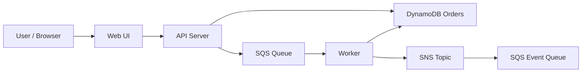

# 주문 접수와 비동기 처리

상태: `runnable bootstrap`

## 이 아키텍처를 AWS에서 왜 많이 쓰나

동기 API는 빠르게 요청만 받고, 실제 처리는 `SQS` 큐와 워커로 넘기며, 상태 변경은 `SNS`로 퍼뜨리는 구조는 AWS 백엔드에서 매우 흔합니다.

AWS 참고 링크:
- SQS: https://docs.aws.amazon.com/AWSSimpleQueueService/latest/SQSDeveloperGuide/welcome.html
- SNS: https://docs.aws.amazon.com/sns/latest/dg/welcome.html
- DynamoDB: https://docs.aws.amazon.com/amazondynamodb/latest/developerguide/Introduction.html

## Mermaid 아키텍처



## Workflow (Excalidraw)

- [workflow.excalidraw](./workflow.excalidraw)

## Trade-off

| 좋아지는 점 | 나빠지는 점 | 언제 적합한가 |
|---|---|---|
| 요청/처리를 분리해 API를 가볍게 유지 | 상태 추적이 복잡해짐 | 주문, 배치, 알림 처리 |
| 실패 시 재처리 구조를 만들기 좋음 | 즉시 완료 응답이 어려움 | 시간이 걸리는 후처리 |
| fan-out으로 다른 소비자를 붙이기 쉬움 | 설계가 단일 CRUD보다 어려움 | 이벤트 중심 백엔드 |

## 핸즈온 가이드

공통 준비는 [apps/README.md](../README.md)를 먼저 읽습니다.

### 1. 리소스 준비

```bash
bash ops/bootstrap-floci.sh
bash apps/order-processing/scripts/setup.sh
```

### 2. 워커와 API 실행

```bash
node apps/order-processing/worker/worker.mjs
node apps/order-processing/api/server.mjs
```

기본 주소: `http://127.0.0.1:3002`

### 3. 중간 확인

CLI:

```bash
aws --profile floci --endpoint-url http://localhost:4566 sqs list-queues
aws --profile floci --endpoint-url http://localhost:4566 sns list-topics
```

Web UI:

- 주문을 하나 생성한다
- 상태가 `PENDING`에서 `COMPLETED`로 바뀌는지 본다
- 이벤트 패널에 fan-out 결과가 보이는지 확인한다

### 4. 최종 검증

```bash
bash apps/order-processing/checks/smoke.sh
```
