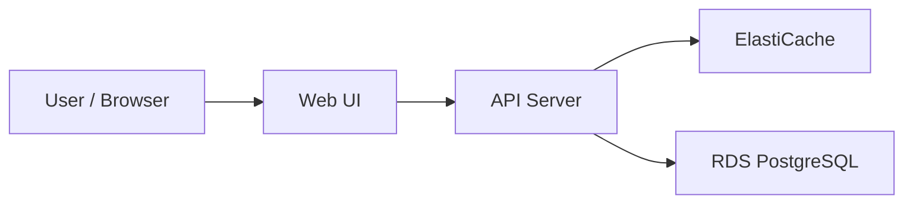
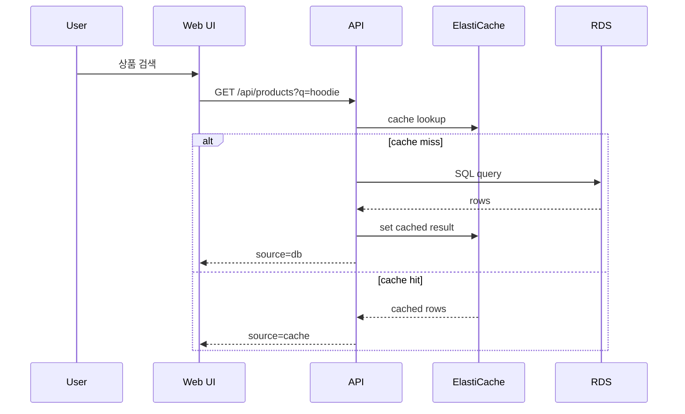
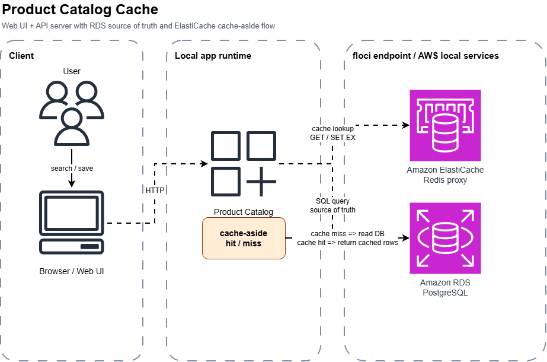

# 상품 카탈로그 캐시

상태: `runnable bootstrap`

## 이 아키텍처를 AWS에서 왜 많이 쓰나

상품, 검색, 설정 목록처럼 같은 조회가 반복되는 화면은 원본 DB만 계속 읽으면 느려지고 비용도 늘어납니다.
그래서 `RDS`에 정합성 있는 원본 데이터를 두고, 자주 읽는 결과는 `ElastiCache`에 짧게 캐시하는 구성이 흔합니다.
이 예제는 그중 가장 기본적인 `cache-aside` 패턴을 `floci`에서 직접 확인하는 데 초점을 둡니다.

AWS 참고 링크:
- RDS: https://docs.aws.amazon.com/AmazonRDS/latest/UserGuide/Welcome.html
- ElastiCache: https://docs.aws.amazon.com/AmazonElastiCache/latest/dg/WhatIs.html

## Mermaid 아키텍처



## Mermaid 시퀀스



## Draw.io

[draw.io source](./assets/product-catalog-cache-architecture.drawio)



## Trade-off

| 좋아지는 점 | 나빠지는 점 | 언제 적합한가 |
|---|---|---|
| 반복 조회 응답을 빠르게 만들 수 있음 | 캐시 무효화 전략을 같이 설계해야 함 | 상품 목록, 검색, 설정 목록 |
| 원본 DB와 캐시 역할을 분리할 수 있음 | 구조가 단일 DB보다 복잡해짐 | 조회량이 쓰기보다 큰 서비스 |
| `cache hit / miss`를 눈으로 확인하며 학습 가능 | `docker.sock`과 추가 포트, `psql` 준비가 필요 | RDS + ElastiCache 기초 학습 |

## 핸즈온 가이드

공통 준비는 [apps/README.md](../README.md)를 먼저 읽습니다.

추가 준비:

- `psql` 클라이언트가 필요합니다.

### 1. 리소스 준비

```bash
bash ops/bootstrap-floci.sh
bash apps/product-catalog-cache/scripts/setup.sh
```

### 2. 서버 실행

```bash
node apps/product-catalog-cache/api/server.mjs
```

기본 주소: `http://127.0.0.1:3011`

처음부터 모니터링까지 같이 띄우려면:

```bash
npm run product-catalog-cache:bootstrap:monitoring
```

### 3. 중간 확인

CLI:

```bash
bash ops/aws-local.sh rds describe-db-instances --db-instance-identifier product-catalog-db
bash ops/aws-local.sh elasticache describe-replication-groups --replication-group-id product-catalog-cache
```

Web UI:

- 상품을 하나 저장한다
- 같은 검색어로 두 번 검색한다
- 첫 응답은 `db`, 다음 응답은 `cache`인지 본다
- 상품 상세를 두 번 눌러 `source`가 어떻게 바뀌는지 본다

### 4. 최종 검증

```bash
bash apps/product-catalog-cache/checks/smoke.sh
```

## 모니터링 확장

이 앱은 로컬 모니터링 예제로도 확장되었습니다.

- 앱은 `/metrics`에서 Prometheus 형식 메트릭을 제공합니다.
- 앱 요청과 cache hit / miss는 JSON 로그 파일로도 남깁니다.
- `Grafana + Prometheus + Loki + Promtail` 구성은 [ops/monitoring/README.md](/mnt/d/github/floci_test/ops/monitoring/README.md)와
  [ops/docker-compose.floci.yml](/mnt/d/github/floci_test/ops/docker-compose.floci.yml)에 있습니다.

실행:

```bash
node apps/product-catalog-cache/api/server.mjs
docker compose -f ops/docker-compose.floci.yml up -d grafana prometheus loki promtail
```

한 번에 같이 실행:

```bash
npm run product-catalog-cache:bootstrap:monitoring
```

기본 주소:

- 앱: `http://127.0.0.1:3011`
- Grafana: `http://127.0.0.1:3012`
- Prometheus: `http://127.0.0.1:9091`
- Loki: `http://127.0.0.1:3101`

모니터링 검증:

```bash
bash ops/monitoring/checks/product-catalog-cache-smoke.sh
```

## 리소스 상태 확인 (CLI)

### RDS 확인

```bash
bash ops/aws-local.sh rds describe-db-instances --db-instance-identifier product-catalog-db
```

### ElastiCache 확인

```bash
bash ops/aws-local.sh elasticache describe-replication-groups --replication-group-id product-catalog-cache
```

이렇게 해석합니다:

- `Endpoint.Port`가 보이면 DB proxy가 준비된 상태입니다
- `ConfigurationEndpoint.Port`가 보이면 cache proxy가 준비된 상태입니다
- Web API의 `source`가 `cache`로 바뀌면 cache-aside가 실제로 동작한 것입니다
