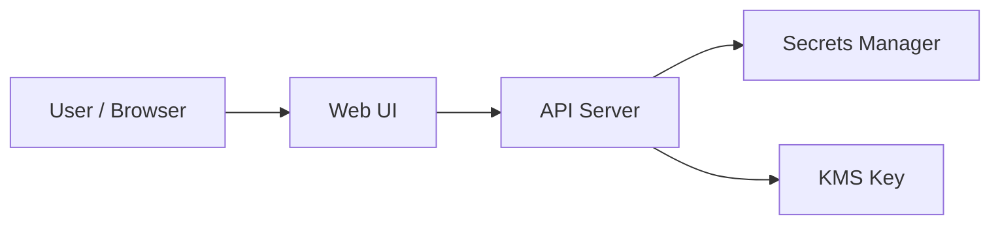

# 비밀 보관함

상태: `runnable bootstrap`

## 이 아키텍처를 AWS에서 왜 많이 쓰나

비밀은 코드나 평문 설정 파일에 두지 않고, `Secrets Manager`에 저장하고 `KMS`로 보호하는 것이 AWS의 대표적인 운영 패턴입니다.

AWS 참고 링크:
- Secrets Manager: https://docs.aws.amazon.com/secretsmanager/latest/userguide/intro.html
- KMS: https://docs.aws.amazon.com/kms/latest/developerguide/overview.html

## Mermaid 아키텍처



## Workflow (Excalidraw)

- [workflow.excalidraw](./workflow.excalidraw)

## Trade-off

| 좋아지는 점 | 나빠지는 점 | 언제 적합한가 |
|---|---|---|
| 비밀을 코드 밖으로 분리 가능 | 단순 환경변수보다 이해가 어려움 | 운영 비밀이 있는 서비스 |
| 목록과 실제 값 조회를 분리 가능 | 접근 제어 설계를 따로 생각해야 함 | DB 비밀번호, API 키 보관 |
| KMS와 함께 보호 계층을 분리 가능 | 로컬 실습에서도 개념이 많음 | 보안 감각 학습 |

## 핸즈온 가이드

공통 준비는 [apps/README.md](../README.md)를 먼저 읽습니다.

### 1. 리소스 준비

```bash
bash ops/bootstrap-floci.sh
bash apps/secret-vault/scripts/setup.sh
```

### 2. 서버 실행

```bash
node apps/secret-vault/api/server.mjs
```

기본 주소: `http://127.0.0.1:3007`

### 3. 중간 확인

CLI:

```bash
aws --profile floci --endpoint-url http://localhost:4566 kms list-keys
aws --profile floci --endpoint-url http://localhost:4566 secretsmanager list-secrets
```

Web UI:

- 비밀을 하나 저장한다
- 목록에는 마스킹된 값만 보이는지 본다
- 상세 조회에서 실제 값이 보이는지 확인한다

### 4. 최종 검증

```bash
bash apps/secret-vault/checks/smoke.sh
```
