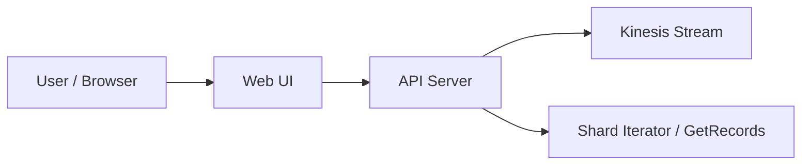
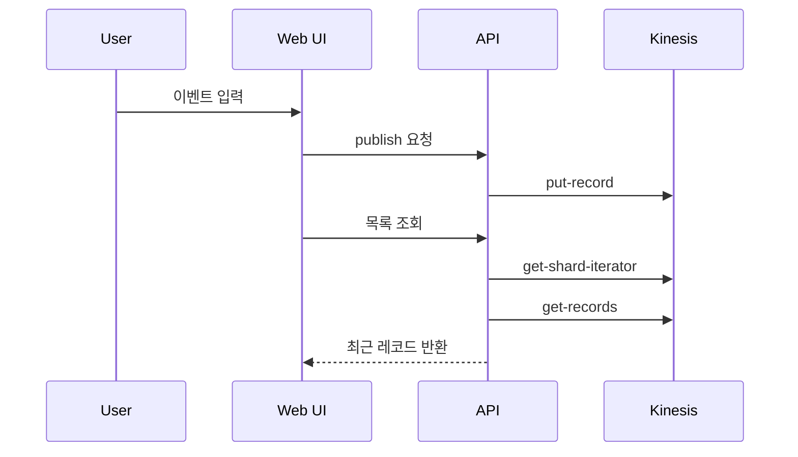
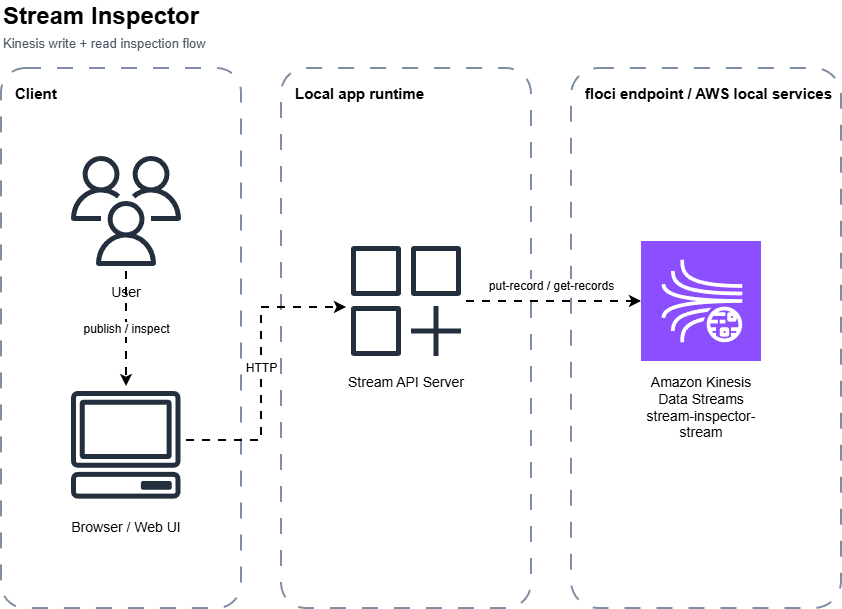

# 스트림 인스펙터

상태: `runnable bootstrap`

## 이 아키텍처를 AWS에서 왜 많이 쓰나

`Kinesis`는 실시간 이벤트 스트림을 버퍼링하고 여러 소비자가 읽게 만드는 데 많이 쓰입니다.  
로그, 클릭 이벤트, telemetry, pipeline 입력에 자주 등장합니다.

AWS 참고 링크:
- Kinesis Data Streams: https://docs.aws.amazon.com/streams/latest/dev/introduction.html

## Mermaid 아키텍처



## Mermaid 시퀀스



## Draw.io (AWS 공식 아이콘)

[draw.io source](./assets/stream-inspector-architecture.drawio)



## Trade-off

| 좋아지는 점 | 나빠지는 점 | 언제 적합한가 |
|---|---|---|
| 이벤트를 순차적으로 쌓고 읽기 좋음 | shard, iterator 개념이 낯설 수 있음 | 스트리밍 학습 |
| producer/consumer 분리 가능 | 단순 큐보다 개념이 많음 | 실시간 이벤트 처리 |
| 시계열 이벤트 흐름을 보기 좋음 | exactly-once 같은 보장은 별도 설계 필요 | 로그/telemetry 흐름 |

## 핸즈온 가이드

공통 준비는 [apps/README.md](../README.md)를 먼저 읽습니다.

### 1. 리소스 준비

```bash
bash ops/bootstrap-floci.sh
bash apps/stream-inspector/scripts/setup.sh
```

### 2. 서버 실행

```bash
node apps/stream-inspector/api/server.mjs
```

기본 주소: `http://127.0.0.1:3009`

### 3. 중간 확인

CLI:

```bash
bash ops/aws-local.sh kinesis list-streams
```

Web UI:

- partition key와 payload를 넣어 발행한다
- 최근 레코드 목록에서 sequence number와 payload가 보이는지 확인한다

## 리소스 상태 확인 (CLI)

### Stream 목록 확인

```bash
bash ops/aws-local.sh kinesis list-streams
```

예시 출력:

```json
{
  "StreamNames": [
    "stream-inspector-stream"
  ]
}
```

### Stream 상세 확인

```bash
bash ops/aws-local.sh kinesis describe-stream --stream-name stream-inspector-stream
```

이렇게 해석합니다:

- `StreamStatus`가 `ACTIVE`면 스트림은 준비된 상태입니다.
- shard가 1개 보이면 현재 예제 기준 구성과 맞습니다.

### 4. 최종 검증

```bash
bash apps/stream-inspector/checks/smoke.sh
```
