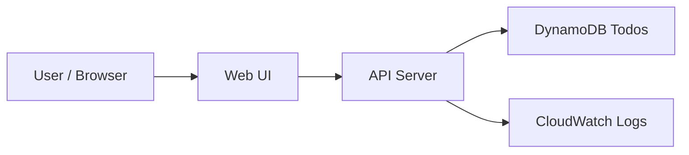
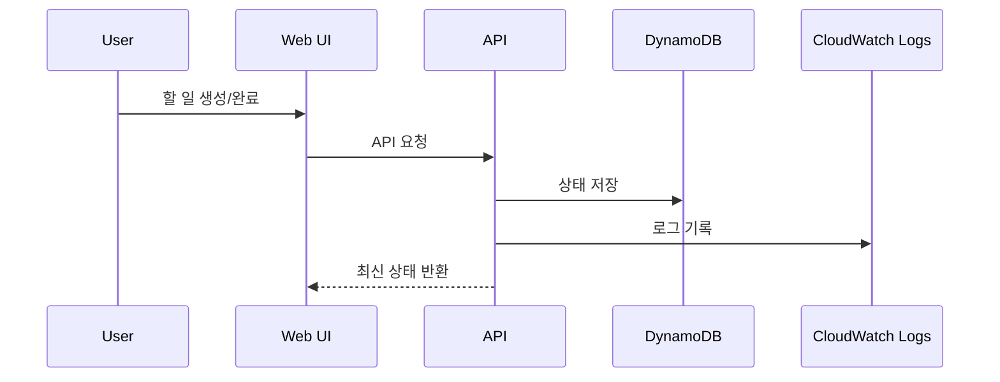

# 할 일 관리 API + 상태 로그

상태: `runnable bootstrap`

## 이 아키텍처를 AWS에서 왜 많이 쓰나

비즈니스 상태는 `DynamoDB`, 운영 추적은 `CloudWatch Logs`로 분리하는 구조는 실무에서 매우 흔합니다.

AWS 참고 링크:
- DynamoDB: https://docs.aws.amazon.com/amazondynamodb/latest/developerguide/Introduction.html
- CloudWatch Logs: https://docs.aws.amazon.com/AmazonCloudWatch/latest/logs/WhatIsCloudWatchLogs.html

## Mermaid 아키텍처



## Mermaid 시퀀스



## Workflow (Excalidraw)

## Trade-off

| 좋아지는 점 | 나빠지는 점 | 언제 적합한가 |
|---|---|---|
| 상태와 운영 로그를 분리 가능 | 로그를 별도로 봐야 함 | 작은 서비스 운영 연습 |
| CRUD와 관측성을 같이 배움 | 단순 CRUD보다 설명이 길어짐 | 백엔드 입문 예제 |
| 상태 변경 추적이 쉬움 | 로그 비용/관리 고려 필요 | 운영 감각이 필요한 앱 |

## 핸즈온 가이드

공통 준비는 [apps/README.md](../README.md)를 먼저 읽습니다.

### 1. 리소스 준비

```bash
bash ops/bootstrap-floci.sh
bash apps/todo-logs/scripts/setup.sh
```

### 2. 서버 실행

```bash
node apps/todo-logs/api/server.mjs
```

기본 주소: `http://127.0.0.1:3004`

### 3. 중간 확인

CLI:

```bash
bash ops/aws-local.sh dynamodb list-tables
bash ops/aws-local.sh logs describe-log-groups
```

Web UI:

- 할 일을 생성한다
- 완료 토글 후 상태가 바뀌는지 본다
- 로그 패널에 이벤트가 남는지 확인한다

## 리소스 상태 확인 (CLI)

### DynamoDB 테이블 확인

```bash
bash ops/aws-local.sh dynamodb describe-table --table-name todos
```

예시 출력:

```json
{
  "Table": {
    "TableName": "todos",
    "TableStatus": "ACTIVE",
    "ItemCount": 2
  }
}
```

### CloudWatch Logs 확인

```bash
bash ops/aws-local.sh logs describe-log-groups
bash ops/aws-local.sh logs get-log-events --log-group-name /floci/todo-logs --log-stream-name todo-api
```

예시 출력:

```json
{
  "events": [
    { "message": "[TODO_CREATED] id=..." },
    { "message": "[TODO_TOGGLED] id=... completed=true" }
  ]
}
```

이렇게 해석합니다:

- 로그 그룹이 보이면 logging 경로는 준비된 상태입니다.
- `TODO_CREATED`, `TODO_TOGGLED`가 보이면 상태 변경 로그도 정상입니다.

### 4. 최종 검증

```bash
bash apps/todo-logs/checks/smoke.sh
```
