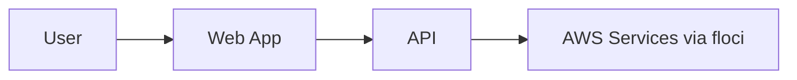

# {Hands-on Title}

## 무엇을 만드는가

{문제 시나리오를 3-5문장으로 설명}

## 완성 후 배우는 것

- {학습 포인트 1}
- {학습 포인트 2}
- {학습 포인트 3}

## 사용 서비스와 역할

- `{service}`: {role}
- `{service}`: {role}

## 아키텍처



## 사전 준비

- `macOS` 또는 `WSL Ubuntu`
- `Docker 20.10+`
- `docker compose v2+`
- `Node.js 22`
- `npm`
- `aws` CLI
- AWS endpoint: `http://localhost:4566`
- AWS profile: `floci`
- isolated AWS config: `.aws-local/config`, `.aws-local/credentials`

## 실행 순서

1. `npm run bootstrap`
2. `npm run aws:profile`
3. `apps/{slug}/scripts/setup.sh`
4. `npm run verify:floci`
5. 예제 앱 실행

## endpoint 규칙

- CLI 명령은 항상 `--profile floci --endpoint-url http://localhost:4566`를 붙인다.
- SDK 설정은 `endpoint=http://localhost:4566`, `region=us-east-1`, dummy credentials를 사용한다.
- 실제 AWS 기본 프로필은 바꾸지 않고, 저장소 내부 `.aws-local/` 설정을 사용한다.

## 핵심 코드 포인트

- `web/`: 화면과 사용자 흐름
- `api/`: 리소스 생성 및 조회 로직
- `scripts/`: 초기 리소스 준비
- `checks/`: 검증 스크립트

## 검증 명령

```bash
apps/{slug}/checks/smoke.sh
```

## 리소스 상태 확인 (CLI)

```bash
bash ops/aws-local.sh {service} {command}
```

예시 출력:

```json
{}
```

이렇게 해석합니다:

- {무엇이 보이면 정상인지}
- {무엇이 부족하면 비정상인지}

## 자주 틀리는 포인트

- `--endpoint-url http://localhost:4566` 누락
- `floci` 프로필을 만들지 않음
- `Lambda`가 필요한 예제에서 Docker socket 마운트 누락

## 확장 과제

- {확장 과제 1}
- {확장 과제 2}
